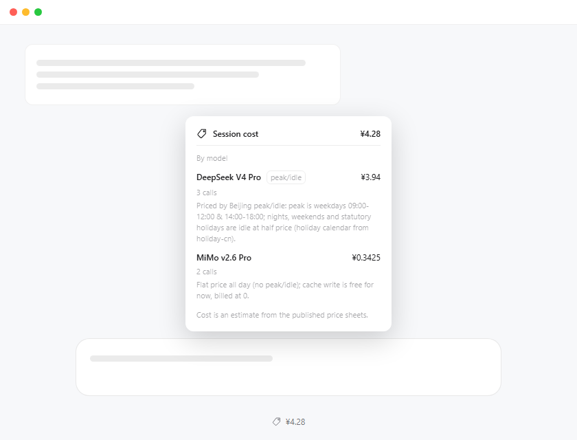
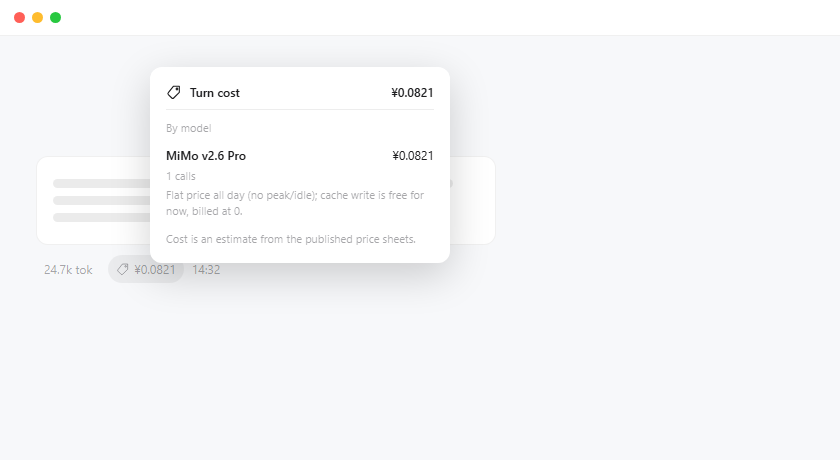

# Session Billing

> 🌐 [简体中文](README.md) | **English**

[](https://www.npmjs.com/package/dsh-session-billing)
[](https://www.npmjs.com/package/dsh-session-billing)
[](LICENSE)

A **per-session LLM cost estimator** for the DeepSeek Harness Web UI: it accumulates provider-reported usage into four disjoint buckets (uncached input / cache read / cache write / output), prices them against the official pay-as-you-go sheets, and shows the **session total** under the composer plus the **cost of each turn** next to every reply — each opening into a per-model breakdown.

Costs are **estimates** (published price sheets × reported usage), not billing truth. A pure display plugin: no behaviour changes, no session writes, no network requests.

## ✨ Features

- 💲 **Session total**: a price-tag pill ("¥x.xx") in the dock under the composer; click for the per-model breakdown and session total.
- 🔖 **Per-turn cost**: a small price-tag chip ("¥x.xxxx") beside the official usage pill on every reply; click for that turn's breakdown.
- 📊 **Official price sheets**: DeepSeek (with Beijing peak/idle tiering + statutory-holiday handling) and Xiaomi MiMo pay-as-you-go, priced per cache-hit / cache-miss / cache-write / output bucket.
- 🚫 **No guessing for unknown models**: rows read "no price configured", count as ¥0 and stay out of the total.
- 🌏 **Bilingual (Chinese / English)**: UI copy follows the app language and switches live; model descriptions carry both languages inline in the config.
- 🧩 **Config externalised**: rates, matching rules and descriptions live in [`models.config.js`](models.config.js) — adding or updating a model touches one file.

## 📸 Preview

| Session cost (dock pill + breakdown panel) | Turn cost (chip beside the usage pill + breakdown panel) |
|---|---|
|  |  |

## 📦 Install

Install with **Install Bundle** in the Plugin Manager, from either source:

1. **npm package (recommended)**: use [`dsh-session-billing`](https://www.npmjs.com/package/dsh-session-billing) as the install spec;
2. **This repository**: install a local clone of the repo directory directly.

**Restart the Harness** after installing or updating (Host-side changes are not hot-reloaded), then **refresh the page**.

## 💰 Billing semantics

The four buckets are disjoint; one call costs `Σ(bucket × rate) / 1e6` (rates are CNY per 1M tokens):

| Usage bucket | Rate key | DeepSeek | MiMo |
|---|---|---|---|
| Cache read `cacheReadTokens` | `hit` | hit rate | hit rate |
| Uncached input `uncachedInputTokens` | `miss` | miss rate | miss rate |
| Cache write `cacheWriteTokens` | `write` | **= miss rate** (no separate write price) | **0** (free for now) |
| Output `outputTokens` | `out` | output rate | output rate |

- **DeepSeek peak/idle**: peak is Beijing time (UTC+8) weekdays 09:00–12:00 & 14:00–18:00; nights, weekends and statutory holidays are **idle at half price**. The holiday calendar comes from [holiday-cn](https://github.com/NateScarlet/holiday-cn) (daily crawls of the State Council announcements).
- **MiMo**: one flat price all day (no peak/idle); cache write is free for now, billed at 0.

## 🧩 Supported models

| Model | Pricing | Peak {hit, miss, write, out} | Idle |
|---|---|---|---|
| DeepSeek Flash | peak/idle | 0.04 / 2.0 / 2.0 / 8.0 | half price |
| DeepSeek V4 Pro | peak/idle | 0.30 / 9.0 / 9.0 / 27.0 | half price |
| MiMo v2.6 Pro | flat | 0.025 / 3.0 / **0** / 6.0 | same as peak |
| MiMo v2.6 Flash | flat | 0.02 / 1.0 / **0** / 2.0 | same as peak |
| MiMo v2.6 Pro Ultraspeed | flat | 0.25 / 30.0 / **0** / 60.0 | same as peak |

> Models not listed are **never guessed**: their rows read "no price configured" and stay out of the total. Rates come from the vendors' published sheets (as fetched): [DeepSeek](https://api-docs.deepseek.com/zh-cn/quick_start/pricing/) · [MiMo](https://mimo.mi.com/docs/zh-CN/price/pay-as-you-go)

## 🌏 Multilingual

- **UI copy** (titles, labels, footers): Chinese / English, registered with the Harness locale service and **following the app language** — switch it in Settings and everything updates live, no refresh needed.
- **Model descriptions**: inline `{ zh, en }` (DSH's LocalizedText shape) in the model config, resolved against the UI language; rates and both translations live on the same config entry, so they cannot drift apart.

## 🗂 Configuration & maintenance

Rates and model descriptions are concentrated in [`models.config.js`](models.config.js); one entry looks like this:

```js
{
  id: 'deepseek-v4-pro',
  label: 'DeepSeek V4 Pro',
  match: { route: ['deepseek', 'v4-pro'], model: ['pro'], exclude: ['flash'] },
  tiered: true,
  peak: { hit: 0.30, miss: 9.0, write: 9.0, out: 27.0 },
  idle: { hit: 0.15, miss: 4.5, write: 4.5, out: 13.5 },
  note: { en: '…', zh: '…' },
}
```

| To do | Edit | Takes effect |
|---|---|---|
| Add a model / change rates / change a description | `MODELS` in `models.config.js` | restart the Harness |
| Refresh the holiday calendar | `HOLIDAYS` in `models.config.js` (or append via plugin config `config.holidays`) | restart the Harness |
| Change UI copy | `DICT.en` / `DICT.zh` in `client.js` (keep both key sets in sync) | refresh the page |

- Matching rules (`match`) are **case-insensitive substring matches**, first hit in `MODELS` order wins: `route` (provider or model contains any), `model` (model must contain all), `exclude` (model must contain none).
- Pricing regression checks: `node docs/verify-host.mjs`. Architecture and fold semantics are documented in the header comments of `index.js` / `client.js`.

## ⚠️ Notes

- Costs are **estimates**, not billing truth; a long request straddling a tier boundary is attributed to the tier of its settlement time — negligible against 3–4h windows.
- Unknown models and unlisted holidays never get a guessed price: they show as ¥0 / "no price configured", or conservatively over-estimate — never under-charge.

## 📄 License

[GNU General Public License v3.0](LICENSE)
