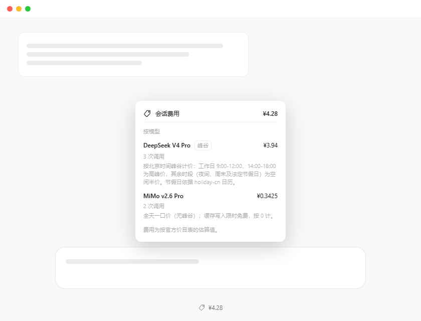
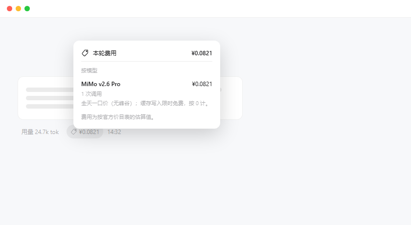

# Session Billing · 会话计费

> 🌐 **中文** | [English](README.en.md)

[](https://www.npmjs.com/package/dsh-session-billing)
[](https://www.npmjs.com/package/dsh-session-billing)
[](LICENSE)

DeepSeek Harness Web UI 的**会话级 LLM 费用估算**插件：把模型上报的用量按「未缓存输入 / 缓存读取 / 缓存写入 / 输出」四桶累计，套官方价目表估算费用——输入框下方看**会话合计**，每条回复旁看**本轮花费**，点开都有按模型明细。

费用是**估算值**（官方价目表 × 上报用量），不是账单真值。纯展示插件：不改行为、不写会话、不发网络请求。

## ✨ 功能

- 💲 **会话合计**：输入框下方 dock 一枚「价签 ¥x.xx」胶囊，点开弹窗查看按模型明细与会话合计。
- 🔖 **本轮费用**：每条回复操作行上，官方「用量」胶囊旁一枚「价签 ¥x.xxxx」小胶囊，点开查看本轮明细。
- 📊 **按官方价目表计价**：DeepSeek（含北京时间峰谷 + 法定节假日判定）与小米 MiMo 按量计费，缓存命中 / 未命中 / 写入 / 输出分桶计价。
- 🚫 **未配置价格的模型不猜价**：明细行标注「未配置价格」，金额按 ¥0 计、不计入合计。
- 🌏 **中英双语**：界面文案跟随应用语言实时切换；模型说明在配置里内联多语言。
- 🧩 **模型配置外置**：价目表、匹配规则、说明文案集中在 [`models.config.js`](models.config.js)，新增 / 更新模型只改一个文件。

## 📸 效果预览

| 会话费用（dock 胶囊 + 明细弹窗） | 本轮费用（回复旁贴片 + 明细弹窗） |
|---|---|
|  |  |

## 📦 安装

在 Plugin Manager 中用 **Install Bundle** 安装，来源二选一：

1. **npm 包（推荐）**：安装规格填 [`dsh-session-billing`](https://www.npmjs.com/package/dsh-session-billing)；
2. **本仓库目录**：直接安装本地克隆的仓库目录。

安装或更新后**重启 Harness**（Host 侧改动不热更），浏览器**刷新页面**。

## 💰 计费口径

四桶互斥；单次调用费用 = `Σ(桶 × 单价) / 1e6`（单价单位：元 / 百万 tokens）：

| 用量桶 | 价目表键 | DeepSeek | MiMo |
|---|---|---|---|
| 缓存读取 `cacheReadTokens` | `hit` | 命中价 | 命中价 |
| 未缓存输入 `uncachedInputTokens` | `miss` | 未命中价 | 未命中价 |
| 缓存写入 `cacheWriteTokens` | `write` | **= 未命中价**（无单列写入价） | **0**（限时免费） |
| 输出 `outputTokens` | `out` | 输出价 | 输出价 |

- **DeepSeek 峰谷**：北京时间（UTC+8）周一至周五 09:00–12:00、14:00–18:00 为高峰价；夜间、周末及法定节假日空闲**半价**。节假日日历来自 [holiday-cn](https://github.com/NateScarlet/holiday-cn)（每日抓取国务院公告）。
- **MiMo**：全天一口价（无峰谷）；缓存写入限时免费，按 0 计。

## 🧩 支持的模型

| 模型 | 计价 | 高峰价 {命中, 未命中, 写入, 输出} | 空闲价 |
|---|---|---|---|
| DeepSeek Flash | 峰谷 | 0.04 / 2.0 / 2.0 / 8.0 | 半价 |
| DeepSeek V4 Pro | 峰谷 | 0.30 / 9.0 / 9.0 / 27.0 | 半价 |
| MiMo v2.6 Pro | 一口价 | 0.025 / 3.0 / **0** / 6.0 | 同高峰 |
| MiMo v2.6 Flash | 一口价 | 0.02 / 1.0 / **0** / 2.0 | 同高峰 |
| MiMo v2.6 Pro Ultraspeed | 一口价 | 0.25 / 30.0 / **0** / 60.0 | 同高峰 |

> 未列出的模型**不猜价**：明细行标注「未配置价格」，不计入合计。价格取自官方价目表（截至抓取时）：[DeepSeek](https://api-docs.deepseek.com/zh-cn/quick_start/pricing/) · [MiMo](https://mimo.mi.com/docs/zh-CN/price/pay-as-you-go)

## 🌏 多语言

- **界面文案**（标题、按钮、说明等）：中 / 英双语，注册进 Harness 的 locale 服务，**跟随应用语言**——设置里切换语言即时生效，无需刷新。
- **模型说明**：随模型配置内联 `{ zh, en }`（DSH 的 LocalizedText 形状），按界面语言解析；价格和两种语言的说明写在同一条配置里，不会漂移。

## 🗂 配置与维护

价目表与模型说明集中在 [`models.config.js`](models.config.js)，每条模型长这样：

```js
{
  id: 'deepseek-v4-pro',
  label: 'DeepSeek V4 Pro',
  match: { route: ['deepseek', 'v4-pro'], model: ['pro'], exclude: ['flash'] },
  tiered: true,
  peak: { hit: 0.30, miss: 9.0, write: 9.0, out: 27.0 },
  idle: { hit: 0.15, miss: 4.5, write: 4.5, out: 13.5 },
  note: { en: '…', zh: '…' },
}
```

| 想做什么 | 改哪里 | 生效方式 |
|---|---|---|
| 新增模型 / 调价 / 改模型说明 | `models.config.js` 的 `MODELS` | 重启 Harness |
| 更新节假日日历 | `models.config.js` 的 `HOLIDAYS`（或插件配置 `config.holidays` 追加） | 重启 Harness |
| 改界面文案 | `client.js` 的 `DICT.en` / `DICT.zh`（两份字典键需同步） | 刷新页面 |

- 匹配规则 `match` 全部为**小写包含匹配**，按 `MODELS` 顺序首命中即用：`route`（provider 或 model 命中其一）、`model`（必须全部包含）、`exclude`（不得包含）。
- 计价回归验证：`node docs/verify-host.mjs`。架构与折叠语义细节见 `index.js` / `client.js` 头部注释。

## ⚠️ 说明

- 费用是**估算值**，不是账单真值；跨峰谷窗口的长请求按结算时刻归档，误差相对 3–4 小时窗口可忽略。
- 未配置价格的模型、未配置的节假日，只会**多算不会少算**或按 ¥0 显示，绝不猜一个价格。

## 📄 License

[GNU General Public License v3.0](LICENSE)
